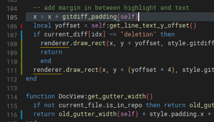

# lite-xl git diff highlight plugin



This plugin will highlight changed lines of any file tracked by git

Clone this repo and symlink `init.lua` and `gitdiff.lua` into `USERDIR/plugins/gitdiff_highlight` or download the files and copy them there

## gitdiff.lua - an oddly specific git diff parser

`gitdiff.lua` is a gitdiff parser, so if you want to parse git diffs in lua for any other reason, feel free to use it under the MIT license

### usage

place `gitdiff.lua` in the same folder as the script you'll be using it with
```lua
local gitdiff = require "gitdiff"

 -- diff is the output of the `git diff` command
 -- this only works on single-file diffs
gitdiff.changed_lines(diff)
-- returns a table that looks like the following:
{
	nil,
	nil,
	"addition",
	"addition",
	nil,
	nil,
	"modification",
	"deletion",
	nil,
	nil
}
-- where the index of the table is the line number the change corresponds to
```

### test.lua
pipe a git diff into its stdin and it will run some tests on `gitdiff.lua`

eg:
	`cat test_diff.txt | lua test.lua`

eg #2:
	`git diff gitdiff.lua | lua test.lua`
